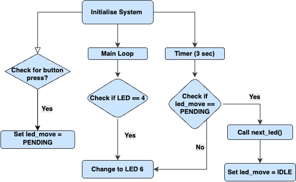
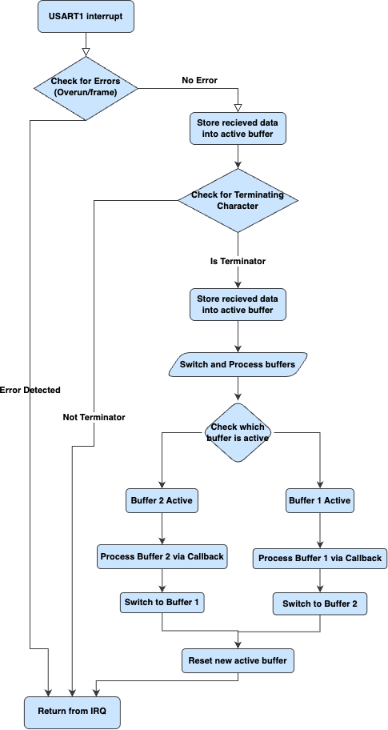
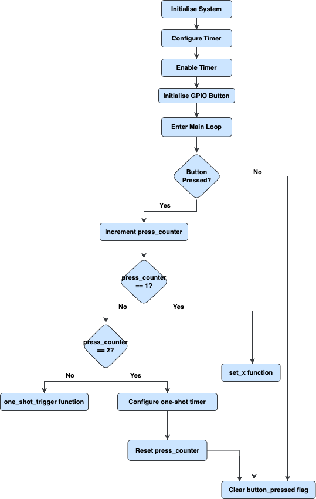

# Clab MTRX2700 C Lab for STM32F3 Discovery Board

## Project Overview

---

## Team Members
- **Will Rumi** - Exercise 3: Timers  
- **Audrey Soo** - Exercise 2: Serial  
- **James Blisset** - Exercise 2: Serial  
- **Marcus Kurishingal** - Exercise 1: Digital I/O

---

## Table of Contents
- [Project Overview](#project-overview)
- [Team Members](#team-members)
- [Exercise 1: Digital I/O](#exercise-1-digital-io)
  - [Part a) Basic Functionality](#part-a-basic-functionality)
  - [Part b)](#part-b) 
  - [Part c)](#part-c)
  - [Part d) Advanced Functionality](#part-d-advanced-functionality)
  - [Discussion Points](#discussion-points)
- [Exercise 2: Serial Interface](#exercise-2-serial-interface)
  - [Part a) Basic Functionality](#part-a-basic-functionality-1)
  - [Part b)](#part-b-1)
  - [Part c)](#part-c-1)
  - [Part d) Advanced Functionality](#part-d-advanced-functionality-1)
  - [Discussion Points](#discussion-points-1)
- [Exercise 3: Timer Interface](#exercise-3-timer-interface)
  - [Part a) Basic Functionality](#part-a-basic-functionality-2)
  - [Part b)](#part-b-2)
  - [Part c) Advanced Functionality](#part-c-advanced-functionality)
  - [Discussion Points](#discussion-points-2)
- [Exercise 4: Integration Task](#exercise-4-integration-task)
  - [Discussion Points](#discussion-points-3)
- [Installation](#installation)
- [Usage](#usage)
- [Contributing](#contributing)

---

## Exercise 1: Digital I/O

### Part a) Basic Functionality
The Digital I/O module provides a simple interface for controlling the LEDs on the STM32F3 Discovery board and reading the state of the user button. This implementation covers the basic requirements for digital I/O control.
Key Features:

- **LED Control**: Interface to control the 8 LEDs (PE8-PE15) individually
- **Button Reading**: Detection of user button (PA0) state
- **Hardware Abstraction**: Encapsulation of register access and bit manipulation


  
### Part b)


### Part c)

### Part d) Advanced Functionality



### Discussion Points

---

## Exercise 2: Serial Interface

### Part a) Basic Functionality
Uses polling to handle UART transmission and reception while monitoring for a terminator character. 
#### Features: 
- **Periodic transmission**: Of a predefined string message
- **LED toggle**: When terminator character is received
- Echo of **received buffer contents** after terminator detection
---
#### `USART1_SendChar()`

```c
// Function to send a single character
void USART1_SendChar(unsigned char c)
{
    // Wait until the transmit data register is empty
    while(!(USART1->ISR & USART_ISR_TXE_Msk));


    // Write the character to the transmit data register
    USART1->TDR = c;
}
```
**Purpose:**
Sends a single character over UART.

**Input:**
- c: Character to transmit

**Output:**
- Transmits the character via UART

**Constraints:**
- Blocking function that waits until the transmit data register is empty

#### `USART1_SendString(const char* str)`
**Purpose:** Sends a null-terminated string over UART.

**Input:**
- str: Pointer to the null-terminated string to transmit

**Output:**
- Transmits each character in the string
- Automatically adds carriage return ('\r') and line feed ('\n') at the end

**Constraints:**
- Calls the blocking USART1_SendChar function

---

Other functions used:
`enableUSART1()`, `enableLEDs()`

### Part b)
#### `processBuffer()`

```c
void processBuffer(unsigned char* buffer, int size);

 // Function to process buffer contents - always processes the inactive buffer
 void processBuffer(unsigned char* buffer, int size) {
	 buffer[size] = '\0';
	uint8_t* lights = ((uint8_t*)&(GPIOE->ODR)) + 1;
	*lights = !(*lights);

	// For demonstration purposes, send a message indicating buffer processing
	SerialOutputString("Processing inactive buffer...",&USART1_PORT);
	// Now call parseCommand
	parseCommand(buffer);
 }
```


### Part c)

### Part d) Advanced Functionality
#### Features: 
- **Serial Communication**: 115200 baud UART with interrupt-driven RX
- **LED Control**: GPIO interface for 8 LEDs (Port E)
- **Command Framework**: Buffered input system with `processBuffer` callback
- **Dual-buffer receive system**: With interrupt handling and buffer switching


#### `SerialInitialise()`
```c
void SerialInitialise(uint32_t baudRate, SerialPort *serial_port, char terminator, void (*rx_parsing)(unsigned char*, int)) {

	rx_complete_callback = rx_parsing;

	// enable clock power, system configuration clock and GPIOC
	// common to all UARTs
	RCC->APB1ENR |= RCC_APB1ENR_PWREN;
	RCC->APB2ENR |= RCC_APB2ENR_SYSCFGEN;

	// enable the GPIO which is on the AHB bus
	RCC->AHBENR |= serial_port->MaskAHBENR;

	// set pin mode to alternate function for the specific GPIO pins
	serial_port->GPIO->MODER = serial_port->SerialPinModeValue;

	// enable high speed clock for specific GPIO pins
	serial_port->GPIO->OSPEEDR = serial_port->SerialPinSpeedValue;

	// set alternate function to enable USART to external pins
	serial_port->GPIO->AFR[0] |= serial_port->SerialPinAlternatePinValueLow;
	serial_port->GPIO->AFR[1] |= serial_port->SerialPinAlternatePinValueHigh;

	// enable the device based on the bits defined in the serial port definition
	RCC->APB1ENR |= serial_port->MaskAPB1ENR;
	RCC->APB2ENR |= serial_port->MaskAPB2ENR;

	// Get a pointer to the 16 bits of the BRR register that we want to change
	uint16_t *baud_rate_config = (uint16_t*)&serial_port->UART->BRR; // only 16 bits used!

	// Baud rate calculation from datasheet
	switch(baudRate){
	case BAUD_9600:
		// NEED TO FIX THIS !
		*baud_rate_config = 0x46;  // 115200 at 8MHz
		break;
	case BAUD_19200:
		// NEED TO FIX THIS !
		*baud_rate_config = 0x46;  // 115200 at 8MHz
		break;
	case BAUD_38400:
		// NEED TO FIX THIS !
		*baud_rate_config = 0x46;  // 115200 at 8MHz
		break;
	case BAUD_57600:
		// NEED TO FIX THIS !
		*baud_rate_config = 0x46;  // 115200 at 8MHz
		break;
	case BAUD_115200:
		*baud_rate_config = 0x46;  // 115200 at 8MHz
		break;
	}

	// enable serial port for tx and rx
	serial_port->UART->CR1 |= USART_CR1_TE | USART_CR1_RE | USART_CR1_UE;

	//Defining the user defined terminating character on initialisation
	ter_char = terminator;
}
```

**Purpose:**  
Initializes USART1, GPIO pins, baud rate, and sets up RX interrupt handling with a terminator character.

**Input:**
- `uint32_t baudRate` — Desired baud rate (e.g., `BAUD_115200`)
- `SerialPort *serial_port` — Pointer to the USART configuration struct (e.g., `&USART1_PORT`)
- `char terminator` — Character to indicate end of message (e.g., `'$', '\n'`)
- `void (*rx_parsing)(unsigned char*, int)` — Callback function for processing received data

**Output:**
- *None (void function)*  
  Initializes peripherals and assigns internal state (side effects).

---

#### `USART1_EXTI25_IRQHandler()`

```c
void USART1_EXTI25_IRQHandler() {
    // Check for overrun or frame errors
    if ((USART1->ISR & USART_ISR_FE_Msk) && (USART1->ISR & USART_ISR_ORE_Msk)) {
        return;
    }

    // Store the read data in active buffer if there's space
    if (*activeBufferSize < BUFFER) {
        activeBuffer[*activeBufferSize] = data;
        (*activeBufferSize)++;
    }

    // Toggle LEDs to indicate char received
    // Note: probably not needed
    if (data == ter_char) {
        uint8_t* lights = ((uint8_t*)&(GPIOE->ODR)) + 1;
        *lights = !(*lights);
    }

    // Switch to the other buffer and process the now-inactive buffer
    if (activeBufferNum == 1) {
        // Parse active buffer contents and size
        rx_complete_callback(buffer1, buffer1Size);

        // Switch active buffer to buffer2
        activeBuffer = buffer2;
        activeBufferSize = &buffer2Size;
        activeBufferNum = 2;
    } else {
        // Process the buffer we're switching from
        rx_complete_callback(buffer2, buffer2Size);

        // Switch active buffer to buffer1
        activeBuffer = buffer1;
        activeBufferSize = &buffer1Size;
        activeBufferNum = 1;
    }

    // Reset the size for the new active buffer
    // Note: need to be able to reset the buffer too
    *activeBufferSize = 0;
    memset(activeBuffer, 0, BUFFER);
}
```
**Purpose:**  
Interrupt Service Routine for USART1 — handles incoming characters, detects terminator, manages double-buffering, and triggers the parsing callback.

**Input:**
- *None (triggered by hardware interrupt)*

**Output:**
- *None (void function)*  
  Processes buffers and calls `rx_complete_callback()` internally.

**Double Buffer Functionality:**




---

#### `processBuffer()`
**Purpose:**  
Custom user-defined callback (part b) to process a fully received buffer (inactive buffer after terminator character).

**Input:**
- `unsigned char *buffer` — Pointer to the buffer that contains received characters
- `int size` — Number of bytes in the buffer

**Output:**
- *None (void function)*  
  You define what to do with the data — e.g., parsing commands, logging, forwarding, etc.


#### `SerialOutputString()`
```c
void SerialOutputString(uint8_t *pt, SerialPort *serial_port) {
	uint32_t counter = 0;
	while(*pt) {
		SerialOutputChar(*pt, serial_port);
		counter++;
		pt++;
	}
	serial_port->completion_function(counter);
}
```
**Purpose:**  
Transmits a **null-terminated string** over USART1 using blocking (polling) transmission.

**Input:**
- `uint8_t *pt` — Pointer to the null-terminated string to be sent  
- `SerialPort *serial_port` — Pointer to the USART config struct

**Output:**
- *None (void function)*  
  Sends each character over the TX register.


#### Discussion Points

---

## Exercise 3: Timer Interface

### Part a) Basic Functionality
Overview:
This module demonstrates how to implement a **software timer system** on the STM32F3 Discovery board using **Timer 2** to generate periodic interrupts that invoke a user-defined **callback function**.

The core functionality involves using a timer interrupt to trigger a function (such as toggling LEDs) at a configurable time interval. It showcases function pointers, NVIC interrupt configuration, and low-level peripheral access on STM32.

Functions:
`enable_clocks()`
`initialise_board()`
`timer_init(uint32_t time_period_ms, callback_t cb)`

### Part b)

### Part c) Advanced Functionality



### Discussion Points

---

## Exercise 4: Integration Task

### Discussion Points

---

## Installation
Instructions for setting up the project locally.

---

## Usage
How to use the project after installation.

---

## Contributing
How to contribute to the project.

