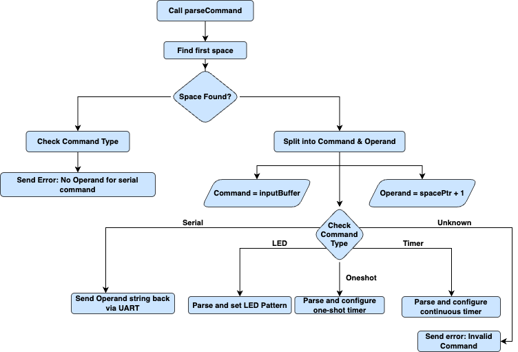

# Clab MTRX2700 C Lab for STM32F3 Discovery Board

## Project Overview

---

## Team Members
- **Will Rumi** - Exercise 3: Timers  
- **Audrey Soo** - Exercise 2: Serial  
- **James Blisset** - Exercise 2: Serial  
- **Marcus Kurishingal** - Exercise 1: Digital I/O

---

## Table of Contents
- [Project Overview](#project-overview)
- [Team Members](#team-members)
- [Exercise 1: Digital I/O](#exercise-1-digital-io)
  - [Overview](#part-a-basic-functionality)
  - [Functions](#part-b) 
  - [Limitations](#part-c)
  - [Discussion Points](#discussion-points)
- [Exercise 2: Serial Interface](#exercise-2-serial-interface)
  - [Part a) Basic Functionality](#part-a-basic-functionality-1)
  - [Part b)](#part-b-1)
  - [Part c)](#part-c-1)
  - [Part d) Advanced Functionality](#part-d-advanced-functionality-1)
  - [Discussion Points](#discussion-points-1)
- [Exercise 3: Timer Interface](#exercise-3-timer-interface)
  - [Overview](#overview)
  - [Functions)](#Functions)
  - [Limitations)](#Limitations)
  - [Discussion Points](#discussion-points-2)
- [Exercise 4: Integration Task](#exercise-4-integration-task)
  - [Discussion Points](#discussion-points-3)
- [Installation](#installation)
- [Usage](#usage)
- [Contributing](#contributing)

---

## Exercise 1: Digital I/O

### Overview
The Digital I/O module provides a comprehensive interface for controlling the LEDs on the STM32F3 Discovery board and reading the state of the user button. This implementation covers the basic requirements for digital I/O control.
Key Features:


  
### Functions
`DigitalIO_Init(ButtonCallback callback)` 
```c
oid DigitalIO_Init(ButtonCallback callback) {
    // Store the callback function
    buttonCallback = callback;

    // Enable clocks for GPIOA (button) and GPIOE (LEDs)
    RCC->AHBENR |= RCC_AHBENR_GPIOAEN | RCC_AHBENR_GPIOEEN;

    // Configure PE8-PE15 (LEDs) as outputs
    uint16_t *led_output_registers = ((uint16_t *)&(GPIOE->MODER)) + 1;
    *led_output_registers = 0x5555; // Set as outputs (01 pattern for each pin)

    // Configure PA0 (User button) as input (default state)
    // No need to modify GPIOA->MODER since input is 00 (default)

    // Configure with pull-down (button connects to VDD when pressed)
    GPIOA->PUPDR &= ~(0x3);
    GPIOA->PUPDR |= 0x2; // Pull-down (10 pattern)

    // Turn off all LEDs initially
    uint8_t *led_register = ((uint8_t*)&(GPIOE->ODR)) + 1;
    *led_register = 0;

    // Set up button interrupt
    // Disable interrupts while configuring
    __disable_irq();

    // Enable system configuration controller
    RCC->APB2ENR |= RCC_APB2ENR_SYSCFGEN;

    // Connect PA0 to EXTI0
    SYSCFG->EXTICR[0] &= ~(0xF); // Clear EXTI0 bits
    SYSCFG->EXTICR[0] |= SYSCFG_EXTICR1_EXTI0_PA; // PA[0] to EXTI0

    // Configure EXTI0 line for rising edge trigger (button press)
    EXTI->RTSR |= EXTI_RTSR_TR0; // Rising edge trigger
    EXTI->IMR |= EXTI_IMR_MR0; // Enable interrupt on line 0

    // Enable EXTI0 interrupt in NVIC
    NVIC_SetPriority(EXTI0_IRQn, 1);
    NVIC_EnableIRQ(EXTI0_IRQn);

    // Re-enable interrupts
    __enable_irq();
}

```

**Purpose:** Intialises the DIO module with button callback functionality
- Enables clock for GPIOA (button) and GPIOE (LEDs)
- Configures PE8-PE15 (LEDs) as outputs
- Configures button interrupt on PA0
- Store the provided callback function
**Input:** `callback`: Function pointer to be called when button is pressed  
**Output:** None  
**Testing:** Intialise with a callback function and verify it gets called when button is pressed    

`DigitalIO_SetLED(uint8_t ledNumber, uint8_t state)`
```c
void DigitalIO_SetLED(uint8_t ledNumber, uint8_t state) {
    // Validate LED number (0-7)
    if (ledNumber > 7)
        return;

    // Get pointer to LED register
    uint8_t *led_register = ((uint8_t*)&(GPIOE->ODR)) + 1;

    if (state)
        *led_register |= (1 << ledNumber);  // Set bit
    else
        *led_register &= ~(1 << ledNumber); // Clear bit
}
```
**Purpose:** Sets the state of a specific LED
- Controls a single LED based on the LED number (0-7 corresponding to LD3-LD10)
- State parameter determines whether to turn on (non-zero) or off (zero) the LED

**Input:**
- `ledNumber`: LED number (0-7) corresponding to LD3-LD10
- `state`: 0 to turn off, non-zero to turn on
**Output:** None  
**Testing:** Turn each LED on and off individually and verify visually  

`DigitalIO_ReadButton_a()`
```c
uint8_t DigitalIO_ReadButton_a(void) {
    // Read button state from PA0
    return (GPIOA->IDR & GPIO_IDR_0) ? 1 : 0;
}
```
**Purpose:** Reads the current state of the user button  
**Input:** None  
**Output:**
- 1 if button is pressed
- 0 if button is not pressed  
**Testing:** Press the button and verify the function returns 1, release and verify it returns 0  


`DigitalIO_SetButtonCallback(ButtonCallback callback)`
```c
void DigitalIO_SetButtonCallback(ButtonCallback callback) {
    buttonCallback = callback;
}
```
**Purpose:** Sets the callback function for button press events.
**Input:** `callback`: New function pointer to be called when button is pressed   
**Output:** None  
**Testing:** Change callback to different functions and verify the new function is called on button press


`get_led_state()`
```c
// Get function
uint8_t get_led_state(){
	return current_led;
}
```
**Purpose:**  Gets the current LED state (which LED is active).  
**Input:** None  
**Output:** Current active LED number (0-7)  
**Testing:** Verify that the returned value matches the current LED


`set_led_state(uint8_t new_val)`
```c
// Set function
void set_led_state(uint8_t new_val){
	current_led = new_val;
}
```
**Purpose:** Sets the current LED state (which LED should be active).  
**Input:** `new_val`: New LED number (0-7)  
**Output:** None  
**Testing:** Verify that changing the LED state actually updates the internal state variable.


`next_led()`
```c
// Callback function - moves to next LED
void next_led(void) {
    // Turn off current LED
    DigitalIO_SetLED(get_led_state(), 0);

    // Move to next LED
    set_led_state((get_led_state()+1) % 8);


    // Turn on new current LED
    DigitalIO_SetLED(get_led_state(), 1);
}
```
**Purpose:** Callback function that moves to the next LED in sequence.  
**Input:** None  
**Output:** None  
**Testing:** Verify that calling this function cycles to the next LED.


`new_callback_function()`
```c
void new_callback_function(void){
// If there is no delay, act as normal
	if (led_move == LED_IDLE) {
		led_move = LED_MOVE_PENDING;

	}
}

```
**Purpose:** Button press callback that sets the LED move state to pending instead of immediately moving the LED  
**Input:** None  
**Output:** None  
**Testing:** Verify that button presses update the LED state to pending without immediately changing LEDs


`initialise_delay()`
```c
// Timer initialization
void initialise_delay(void) {
    // Enable clock for TIM2
    RCC->APB1ENR |= RCC_APB1ENR_TIM2EN;

    // Configure TIM2 for periodic checking (e.g., every 500ms)
    TIM2->PSC = 7999;          // in terms of 1 ms
    TIM2->ARR = 2999;          // Get a 3 second delay
    TIM2->DIER |= TIM_DIER_UIE;    // Enable update interrupt
    TIM2->CR1 |= TIM_CR1_CEN;      // Enable counter

    // Configure NVIC for TIM2
    NVIC_SetPriority(TIM2_IRQn, 1);
    NVIC_EnableIRQ(TIM2_IRQn);
}
```
**Purpose:** Initialises the timer for delayed LED response.  
**Input:** None 
**Output:** None  
**Testing:** Verify that the timer is properly initialized and interrupts are generated.

`set_delay(int enable)`
```c
// Function to enable or disable delay mode
void set_delay(int enable) {
    if (enable) {
        initialise_delay();
    } else {
        // Optionally disable timer if not needed
        TIM2->CR1 &= ~TIM_CR1_CEN;
    }
}
```
**Purpose:** Enables or disables the delay mode.  
**Input:** `enable`: 1 to enable delay, 0 to disable 
**Output:** None  
**Testing:** Verify that enabling/disabling delay mode changes the behavior of button responses..


### Limitations
- Concurrency Issues
- Callback blocking
- Single button
- Fixed delay time
- No Debouncing
- No error handling
- Resource conflicts


### Discussion Points

---

## Exercise 2: Serial Interface

### Part a) Basic Functionality
Uses polling to handle UART transmission and reception while monitoring for a terminator character. 
#### Features: 
- **Periodic transmission**: Of a predefined string message
- **LED toggle**: When terminator character is received
- Echo of **received buffer contents** after terminator detection
---
#### `USART1_SendChar()`

```c
// Function to send a single character
void USART1_SendChar(unsigned char c)
{
    // Wait until the transmit data register is empty
    while(!(USART1->ISR & USART_ISR_TXE_Msk));


    // Write the character to the transmit data register
    USART1->TDR = c;
}
```
**Purpose:**
Sends a single character over UART.

**Input:**
- c: Character to transmit

**Output:**
- Transmits the character via UART

**Constraints:**
- Blocking function that waits until the transmit data register is empty
---
#### `USART1_SendString(const char* str)`

```c
// Function to send a string
void USART1_SendString(const char* str)
{
    while(*str)
    {
        USART1_SendChar(*str++);
    }


    // Send carriage return and line feed for proper line ending in terminal
    USART1_SendChar('\r');
    USART1_SendChar('\n');
}
```

**Purpose:** Sends a null-terminated string over UART.

**Input:**
- str: Pointer to the null-terminated string to transmit

**Output:**
- Transmits each character in the string
- Automatically adds carriage return ('\r') and line feed ('\n') at the end

**Constraints:**
- Calls the blocking USART1_SendChar function

---

#### `enableUSART1()`, 
**Purpose:** Initializes and configures the USART1 peripheral and its GPIO pins

**Input:**
- None

**Output:**
- Configures GPIO Port C for UART alternate function
- Sets up USART1 for 115200 baud rate with receive and transmit enabled

**Configuration:**
Uses predefined constants:
- ALTFUNCTION: GPIO alternate function mode
- RXTX: Alternate function register value
- HIGHSPEED: GPIO speed configuration
- BAUDRATE: Value for 115200 baud rate
---
`enableLEDs()`
- Configures the GPIO pins for LED control
---
### Part b)
#### `processBuffer()`

```c
void processBuffer(unsigned char* buffer, int size);

 // Function to process buffer contents - always processes the inactive buffer
 void processBuffer(unsigned char* buffer, int size) {
	 buffer[size] = '\0';
	uint8_t* lights = ((uint8_t*)&(GPIOE->ODR)) + 1;
	*lights = !(*lights);

	// For demonstration purposes, send a message indicating buffer processing
	SerialOutputString("Processing inactive buffer...",&USART1_PORT);
	// Now call parseCommand
	parseCommand(buffer);
 }
```

**Purpose:** Callback Function
- Process Asynchronous Communications - Since UART data arrives asynchronously (at any time), the callback architecture allows the system to respond to incoming data without constantly polling the UART
- Bridges Hardware and Application: It serves as the handoff point between the low-level UART hardware handling (receiving bytes) and the higher-level application logic (interpreting commands)

**Limitations:**
- No Error Handling: There's no mechanism to handle malformed commands or unexpected data, which could lead to unpredictable behavior.
- Limited Buffer Protection: It assumes the buffer has space for a null terminator and doesn't verify this before writing to buffer[size]
- No Return Status: There's no way for the function to indicate success or failure back to the calling system.

---
### Part c)
**Features:**
- Interrupt-Driven Reception: UART reception using interrupts to avoid blocking


##### `SerialInitialise()`
**Purpose:** Initializes a serial port with specified baud rate and callback function.

**Input:**
- baudRate (uint32_t): Enumerated baud rate value (BAUD_9600, BAUD_19200, etc.)
- serial_port (SerialPort*): Pointer to the serial port structure to initialize
- completion_function (function pointer): Callback function invoked after string transmission

**Output:**
- Configured UART peripheral and associated GPIO pins

**Limitations:**
- Only some baud rate configurations are implemented
- Fixed at 8MHz clock assumption for baud rate calculation
- No parity, stop bit, or word length configuration options
---

##### `USART1RX_enableInterrupts()`
**Purpose:** Enables interrupt-driven reception for USART1.

**Input:**
- None

**Output:**
- Configured USART1 to generate interrupts on reception
- Configured NVIC (Nested Vectored Interrupt Controller)

**Limitations:**
- Specific to USART1 only
- Disables all interrupts briefly during configuration

##### `USART1_EXTI25_IRQHandler()`
**Purpose:** Interrupt handler for USART1 reception events

**Input:**
- None (called automatically by hardware on interrupt)

**Output:**
- Updates global buffer with received character
- Toggles LED for visual feedback

**Limitations:**
- Uses global variables (string buffer and index)
- Fixed buffer size (10 bytes)
- Limited error handling (only checks for overrun and frame errors)
- No terminator character detection
- No callback or signal when buffer is full
- No double buffering to prevent data loss during processing

---
### Part d) Advanced Functionality
#### Features: 
- **Serial Communication**: 115200 baud UART with interrupt-driven RX
- **LED Control**: GPIO interface for 8 LEDs (Port E)
- **Command Framework**: Buffered input system with `processBuffer` callback
- **Dual-buffer receive system**: With interrupt handling and buffer switching
---


#### `SerialInitialise()`
```c
void SerialInitialise(uint32_t baudRate, SerialPort *serial_port, char terminator, void (*rx_parsing)(unsigned char*, int)) {

	rx_complete_callback = rx_parsing;

	// enable clock power, system configuration clock and GPIOC
	// common to all UARTs
	RCC->APB1ENR |= RCC_APB1ENR_PWREN;
	RCC->APB2ENR |= RCC_APB2ENR_SYSCFGEN;

	// enable the GPIO which is on the AHB bus
	RCC->AHBENR |= serial_port->MaskAHBENR;

	// set pin mode to alternate function for the specific GPIO pins
	serial_port->GPIO->MODER = serial_port->SerialPinModeValue;

	// enable high speed clock for specific GPIO pins
	serial_port->GPIO->OSPEEDR = serial_port->SerialPinSpeedValue;

	// set alternate function to enable USART to external pins
	serial_port->GPIO->AFR[0] |= serial_port->SerialPinAlternatePinValueLow;
	serial_port->GPIO->AFR[1] |= serial_port->SerialPinAlternatePinValueHigh;

	// enable the device based on the bits defined in the serial port definition
	RCC->APB1ENR |= serial_port->MaskAPB1ENR;
	RCC->APB2ENR |= serial_port->MaskAPB2ENR;

	// Get a pointer to the 16 bits of the BRR register that we want to change
	uint16_t *baud_rate_config = (uint16_t*)&serial_port->UART->BRR; // only 16 bits used!

	// Baud rate calculation from datasheet
	switch(baudRate){
	case BAUD_9600:
		// NEED TO FIX THIS !
		*baud_rate_config = 0x46;  // 115200 at 8MHz
		break;
	case BAUD_19200:
		// NEED TO FIX THIS !
		*baud_rate_config = 0x46;  // 115200 at 8MHz
		break;
	case BAUD_38400:
		// NEED TO FIX THIS !
		*baud_rate_config = 0x46;  // 115200 at 8MHz
		break;
	case BAUD_57600:
		// NEED TO FIX THIS !
		*baud_rate_config = 0x46;  // 115200 at 8MHz
		break;
	case BAUD_115200:
		*baud_rate_config = 0x46;  // 115200 at 8MHz
		break;
	}

	// enable serial port for tx and rx
	serial_port->UART->CR1 |= USART_CR1_TE | USART_CR1_RE | USART_CR1_UE;

	//Defining the user defined terminating character on initialisation
	ter_char = terminator;
}
```

**Purpose:**  
Initializes USART1, GPIO pins, baud rate, and sets up RX interrupt handling with a terminator character.

**Input:**
- `uint32_t baudRate` — Desired baud rate (e.g., `BAUD_115200`)
- `SerialPort *serial_port` — Pointer to the USART configuration struct (e.g., `&USART1_PORT`)
- `char terminator` — Character to indicate end of message (e.g., `'$', '\n'`)
- `void (*rx_parsing)(unsigned char*, int)` — Callback function for processing received data

**Output:**
- *None (void function)*  
  Initializes peripherals and assigns internal state (side effects).

---

#### `USART1_EXTI25_IRQHandler()`

```c
void USART1_EXTI25_IRQHandler() {
    // Check for overrun or frame errors
    if ((USART1->ISR & USART_ISR_FE_Msk) && (USART1->ISR & USART_ISR_ORE_Msk)) {
        return;
    }

    // Store the read data in active buffer if there's space
    if (*activeBufferSize < BUFFER) {
        activeBuffer[*activeBufferSize] = data;
        (*activeBufferSize)++;
    }

    // Toggle LEDs to indicate char received
    // Note: probably not needed
    if (data == ter_char) {
        uint8_t* lights = ((uint8_t*)&(GPIOE->ODR)) + 1;
        *lights = !(*lights);
    }

    // Switch to the other buffer and process the now-inactive buffer
    if (activeBufferNum == 1) {
        // Parse active buffer contents and size
        rx_complete_callback(buffer1, buffer1Size);

        // Switch active buffer to buffer2
        activeBuffer = buffer2;
        activeBufferSize = &buffer2Size;
        activeBufferNum = 2;
    } else {
        // Process the buffer we're switching from
        rx_complete_callback(buffer2, buffer2Size);

        // Switch active buffer to buffer1
        activeBuffer = buffer1;
        activeBufferSize = &buffer1Size;
        activeBufferNum = 1;
    }

    // Reset the size for the new active buffer
    // Note: need to be able to reset the buffer too
    *activeBufferSize = 0;
    memset(activeBuffer, 0, BUFFER);
}
```
**Purpose:**  
Interrupt Service Routine for USART1 — handles incoming characters, detects terminator, manages double-buffering, and triggers the parsing callback.

**Input:**
- *None (triggered by hardware interrupt)*

**Output:**
- *None (void function)*  
  Processes buffers and calls `rx_complete_callback()` internally.

---

**Double Buffer Functionality:**


---

#### `processBuffer()`
**Purpose:**  
Custom user-defined callback (part b) to process a fully received buffer (inactive buffer after terminator character).

**Input:**
- `unsigned char *buffer` — Pointer to the buffer that contains received characters
- `int size` — Number of bytes in the buffer

**Output:**
- *None (void function)*  
  You define what to do with the data — e.g., parsing commands, logging, forwarding, etc.


#### `SerialOutputString()`
```c
void SerialOutputString(uint8_t *pt, SerialPort *serial_port) {
	uint32_t counter = 0;
	while(*pt) {
		SerialOutputChar(*pt, serial_port);
		counter++;
		pt++;
	}
	serial_port->completion_function(counter);
}
```
**Purpose:**  
Transmits a **null-terminated string** over USART1 using blocking (polling) transmission.

**Input:**
- `uint8_t *pt` — Pointer to the null-terminated string to be sent  
- `SerialPort *serial_port` — Pointer to the USART config struct

**Output:**
- *None (void function)*  
  Sends each character over the TX register.

---

### Exercise 3: Timer Interface
### Overview:
This module demonstrates how to implement a **software timer system** on the STM32F3 Discovery board using **Timer 2** to generate periodic interrupts that invoke a user-defined **callback function**.

The core functionality involves using a timer interrupt to trigger a function (such as toggling LEDs) at a configurable time interval. It showcases function pointers, NVIC interrupt configuration, and low-level peripheral access on STM32.

### Functions:
`enable_clocks()`
```c
void enable_clocks() {
    // Enable the clock for the GPIO port of the LED
    RCC->AHBENR |= RCC_AHBENR_GPIOAEN | RCC_AHBENR_GPIOCEN | RCC_AHBENR_GPIOEEN;
    // Enable the peripheral clock for timer 2
    RCC->APB1ENR |= RCC_APB1ENR_TIM2EN | RCC_APB1ENR_TIM2EN;;
}
```
**Purpose:** Enables the necessary peripheral clocks for GPIO ports and Timer 2.
**Inputs:** None  
**Outputs:** None  
**Testing:** After calling this function, verify that the RCC->AHBENR and RCC->APB1ENR registers contain the appropriate bit flags for GPIO and Timer 2 clocks.

`initialise_board()`  
```c
void initialise_board() {
    // Get a pointer to the second half word of the MODER register (for outputs pe8-15)
    uint16_t *led_output_registers = ((uint16_t *)&(GPIOE->MODER)) + 1;
    *led_output_registers = 0x5555;
    // Set all 8 LED's to output mode
}
```
**Purpose:** Initializes the board I/O, configuring PE8-PE15 as outputs for the LEDs.  
**Inputs:** None  
**Outputs:** None  
**Testing:** After calling this function, check that GPIOE->MODER has the correct configuration for pins 8-15.  

`timer_init(uint32_t time_period_ms, callback_t cb)`  
```c
void timer_init(uint32_t time_period_ms, callback_t cb) {
	// Disable the interrupts while messing around with the settings
	//  otherwise can lead to strange behaviour
	__disable_irq();


    // Store the callback function
    timer_callback = cb; // This stores the callback function to be used in the interrupt handler

    // Disable interrupts for the timer
    NVIC_DisableIRQ(TIM2_IRQn);
    // Clear any pending interrupt
    NVIC_ClearPendingIRQ(TIM2_IRQn);

	// TIM2 is a 32 bit timer
    // Set the timer prescaler
    // Goal is to trigger an interrupt based on the provided time_period_ms
    // time_period_ms = (PSC + 1) * (ARR + 1) / 8_000_000 * 1000

    // For a 1ms timer tick: 8MHz / 8000 = 1kHz timer clock
    TIM2->PSC = 7999;

    // Calculate the auto-reload value based on the desired time period
    // For example, if time_period_ms = 2000 (2 seconds), ARR = 1999
    TIM2->ARR = (time_period_ms - 1);

    // Disable Update Request Source (URS) bit
    // This prevents update events from counter initialization
    //TIM2->CR1 &= ~TIM_CR1_URS;

    // Generate an update event to load the new settings
    TIM2->EGR |= TIM_EGR_UG;
    // Clear the update flag that was set by the UG bit
    TIM2->SR &= ~TIM_SR_UIF;
    // Enable update interrupt for Timer 2
    TIM2->DIER |= TIM_DIER_UIE;

    // Configure and enable Timer 2 interrupt in NVIC
    NVIC_SetPriority(TIM2_IRQn, 1); // Set priority (0 is highest, 3 is lowest)
    NVIC_EnableIRQ(TIM2_IRQn);      // Enable the Timer 2 interrupt in NVIC

    // Re-enable all interrupts (now that we are finished)
    __enable_irq();
}
```
**Purpose:** Initializes Timer 2 with a specified time period and registers a callback function to be executed when the timer period elapses.  
**Inputs:**
- time_period_ms: The timer period in milliseconds
- cb: Function pointer to the callback function

**Outputs:** None  
**Testing:**
- Initialize with a known time period and verify that TIM2->ARR is set to (time_period_ms - 1)
- Initialize with a test callback and trigger the timer to verify the callback is executed
- Check that TIM2->DIER has the UIE bit set for update interrupts

`set_led()`  
```c
void set_led(void) {
    // When we've reached LED 8, it means all LEDs are lit, so reset and turn all off
    if (current_led >= 8) {
        // Turn all LEDs off by setting bits 24-31 (which reset pins 8-15)
    	GPIOE->BSRR = 0xFF000000;
        // Reset the counter to start over
        current_led = 0;
        return;
    }

    // Calculate which LED to turn on (PE8 through PE15)
    uint16_t led_pin = 1 << (8 + current_led);

    // Turn on the current LED (without turning off others)
    GPIOE->BSRR = led_pin;

    // Move to the next LED
    current_led++;
}
```
**Purpose:** Handles LED sequencing, turning on LEDs in sequence from PE8 to PE15, and resets the sequence after all LEDs are lit.
**Inputs**: None  
**Outputs**: None  
**Testing**:
- Call the function 8 times and visually verify that each LED turns on in sequence
- Call the function a 9th time and verify all LEDs turn off (sequence resets)

`enable_timer()`  
```c
void enable_timer(void) {
    // Enable the Timer 2 counter
    TIM2->CR1 |= TIM_CR1_CEN;
}
```
**Purpose:**Enables the Timer 2 counter to start the timer operation.
**Inputs:** None  
**Outputs:** None  
**Testing:** After calling this function, verify that TIM2->CR1 has the CEN bit set.  

`set_new_period(uint32_t new_value)`  
```c
void set_new_period(uint32_t new_value){

	// Stop the timer
	TIM2->CR1 &= ~TIM_CR1_CEN;

	// Set new period
	TIM2->ARR = new_value;  // For 500ms (with prescaler of 7999) sets to half second

	//reset the counter value to start fresh
	TIM2->CNT = 0;

	// Restart the timer
	TIM2->CR1 |= TIM_CR1_CEN;
}
```
**Purpose:** Resets the timer with a new period by stopping the timer, updating the period, and restarting it.  
**Inputs:**
- new_value: The new timer period value
**Outputs:** None  
**Testing:**
- Call this function with a new period and verify TIM2->ARR is updated
- Verify the timer stops and restarts by checking TIM2->CR1 CEN bit during execution
- Verify TIM2->CNT is reset to 0

`GPIO_Button_Init()`  
```c
void GPIO_Button_Init(void)
{
  /* Enable clock for GPIOA and SYSCFG */
  RCC->AHBENR |= RCC_AHBENR_GPIOAEN;  // Enable GPIOA clock
  RCC->APB2ENR |= RCC_APB2ENR_SYSCFGEN; // Enable SYSCFG clock

  /* Configure PA0 as input with pull-down */
  GPIOA->MODER &= ~(GPIO_MODER_MODER0); // Input mode (00)
  GPIOA->PUPDR &= ~(GPIO_PUPDR_PUPDR0); // Clear pull-up/down
  GPIOA->PUPDR |= GPIO_PUPDR_PUPDR0_1;  // Set pull-down (10)

  /* Connect EXTI Line0 to PA0 */
  SYSCFG->EXTICR[0] &= ~(SYSCFG_EXTICR1_EXTI0); // Clear EXTI line configuration
  SYSCFG->EXTICR[0] |= SYSCFG_EXTICR1_EXTI0_PA; // PA0 as EXTI source

  /* Configure EXTI Line0 */
  EXTI->IMR |= EXTI_IMR_MR0;    // Enable interrupt on EXTI line 0
  EXTI->RTSR |= EXTI_RTSR_TR0;  // Enable rising trigger
  EXTI->FTSR &= ~EXTI_FTSR_TR0; // Disable falling trigger

  /* Set NVIC priority and enable interrupt */
  NVIC_SetPriority(EXTI0_IRQn, 1); // Set priority
  NVIC_EnableIRQ(EXTI0_IRQn);      // Enable EXTI0 interrupt
}
```
**Purpose:** Initializes the User Button (PA0) with interrupt capability for rising edge detection.  
**Inputs:** None  
**Outputs:** None  
**Testing:**
- After calling this function, verify GPIOA->MODER has pin 0 configured as input
- Verify SYSCFG->EXTICR[0] has PA0 configured as interrupt source
- Press the button and verify the button_pressed flag is set in the interrupt handler

`one_shot_trigger(uint32_t delay, callback_t cb)`  
```c
void one_shot_trigger(uint32_t  delay_ms, callback_t cb_c) {
    // Store the callback function for later use
    oneshot_callback = cb_c;

    // Disable interrupts while configuring the timer
    __disable_irq();

    // Configure timer for one-shot mode
    // First, stop the timer if it's running
    TIM2->CR1 &= ~TIM_CR1_CEN;

    // Disable the timer interrupt NVIC before clearing flags & clear flags
    NVIC_DisableIRQ(TIM2_IRQn);
    NVIC_ClearPendingIRQ(TIM2_IRQn);


    // Set prescaler to create a 1ms time base (assuming 8MHz clock)
    TIM2->PSC = 7999;  // For 1ms ticks (8MHz / 8000 = 1kHz)
    // Set the auto-reload value based on the desired delay
    TIM2->ARR = delay_ms;

    // Generate an update event to load the new settings
    TIM2->EGR |= TIM_EGR_UG;
    // Clear the update flag that was set by the UG bit
    TIM2->SR &= ~TIM_SR_UIF;
    // Enable update interrupt for Timer 2
    TIM2->DIER |= TIM_DIER_UIE;

    // Set one-pulse mode (OPM=1) - this makes the timer stop after one update event
    TIM2->CR1 |= TIM_CR1_OPM;

    // Clear the uIF flag to not trigger an immediate event
    TIM2->SR &= ~TIM_SR_UIF;
    // Enable update interrupt
    TIM2->DIER |= TIM_DIER_UIE;

    // Configure and enable Timer 3 interrupt in NVIC
    NVIC_SetPriority(TIM2_IRQn, 3);  // Lower priority than TIM2
    NVIC_EnableIRQ(TIM2_IRQn);

    // Re-enable interrupts
    __enable_irq();

    // Start the timer
    TIM2->CR1 |= TIM_CR1_CEN;
}
```
**Purpose:** Configures Timer 2 for one-shot operation, triggering the provided callback function once after the specified delay.  
**Inputs:**
- delay: The delay in milliseconds before the callback function is executed
- cb: Function pointer to the callback function
**Outputs:** None  
**Testing:**
- Set up a test callback and trigger a one-shot timer with a known delay
- Verify the callback is executed after the expected delay
- Verify Timer 2 stops after the callback (one-pulse mode)
- Verify TIM2->CR1 has the OPM bit set for one-pulse mode


`flash_led()`  
```c
void flash_led(void) {

	// Turn all LEDs off by setting bits 24-31 (which reset pins 8-15)
	GPIOE->BSRR = 0xFF000000;
	// Set LED1 mask
	uint16_t led_pin = 2 << 8;
	// Turn on LED1
	GPIOE->BSRR = led_pin;

}
```
**Purpose:** Turns off all LEDs and then flashes LED1 (PE9).  
**Inputs:** None  
**Outputs:** None  
**Testing:** Call the function and visually verify all LEDs turn off and LED1 (PE9) turns on.  


### Limitations ###
- Single timer usage (Timer 2 only)
- Potential timer conflicts between periodic and one-shot operations
- Callback execution constraints within interrupt context
- Issues with global variables for state management
- Fixed clock configuration assumptions
- Lack of timer overflow handling
- Limited error handling
- No button debouncing

---

## Exercise 4: Integration Task




### Discussion Points

---

## Installation
Instructions for setting up the project locally.

---

## Usage
How to use the project after installation.

---

## Contributing
How to contribute to the project.

